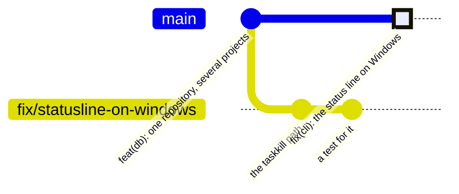

# Contributing

Thank you for looking. Three things are worth knowing before you write a patch,
because all of them are easier to read now than to discover in a pull request.

## The licence

This project is under the [Business Source License 1.1](LICENSE), not an OSI
open-source licence. You can read the source, run it in production for your own
organisation at any size, and modify it. You cannot offer it to third parties as
a commercial hosted service. Four years after each release, that version becomes
Apache 2.0.

Version 1.1.0 and earlier were MIT and remain so — see [LICENSE-MIT](LICENSE-MIT).

## The CLA

Contributions need a Contributor Licence Agreement. It is a **licence**, not an
assignment: you keep the copyright in what you wrote, and you grant the right to
distribute it under this licence and future ones.

The reason is plain rather than legal: there is a hosted version of this coming,
and under BSL alone a contributor's code could not be included in it. Saying so
up front is better than a surprise after the work is done.

Your pull request description carries a box to tick, and CI checks that it is
ticked. **That tick is the agreement** — the full text is in
[.github/CLA.md](.github/CLA.md). Dependency bots are exempt; they contribute no
copyrightable work.

## Getting set up

```bash
bun install
bun run hooks     # once: points git at .githooks/
```

That second line is not optional decoration. Git will not let a repository
configure its own hooks — if it could, cloning one would be remote code
execution — so it is one command, run once, and everything below depends on it.

| Hook | What it does | Cost |
|---|---|---|
| `commit-msg` | Checks the message against [scripts/commit-lint.sh](scripts/commit-lint.sh) | instant |
| `pre-commit` | The three free test files, and refuses a staged database or key | ~10 ms |
| `pre-push` | `typecheck`, the whole suite, `lint:messages` — and refuses a push to `main` | ~2 s |

`--no-verify` skips them and that is fine. **A hook is a convenience, not a
control**: it shortens the feedback loop from eight minutes of CI to two seconds.
It cannot be a control, because `--no-verify` exists and because a contributor
who has not run `bun run hooks` has none of it. The control is on the server.

The rest of the checks, and why some of them are not in any hook:

```bash
bun run typecheck && bun test && bun run lint:messages
bun scripts/mcp-smoke.ts        # the MCP handshake; its preflight can install
node scripts/db-portability.mjs # needs a database that already has a schema
bun run dev                     # the board, at http://127.0.0.1:4477
```

## How a change lands



Read that carefully, because the diagram shows something the word "merge" would
hide: **the branch is not merged, it is flattened.** There is no merge commit,
which is why the branch's line simply ends. What lands on `main` is one new
commit whose message is **the title of the pull request**.

That is the entire reason the title has a required check of its own.

- Branch from `main` as `<type>/<kebab-case>`: `feat/import-project`,
  `fix/symlinked-checkouts`, `chore/bump-bun`. Same vocabulary as the commits.
- Open a pull request. `main` takes no direct pushes.
- CI runs on Linux, macOS and Windows — the matrix is not decoration, because
  this plugin compares filesystem paths, spawns detached processes and shells out
  to whatever opens a URL.
- Squash merge. One pull request becomes one commit, and the branch is deleted.

## What a commit may say

```
<type>(<scope>)!: <subject>
```

`build`, `chore`, `ci`, `docs`, `feat`, `fix`, `perf`, `refactor`, `revert`,
`style`, `test`. The scope is optional and useful here — `mcp`, `db`, `cli`,
`board`, `hooks`, `docs`.

**Only `feat` and `fix` move the version**, and `!` or a `BREAKING CHANGE:`
footer moves the major. That is not a style rule: release-please reads these
commits and the version comes out of them.

The subject is **descriptive prose in lower case, not an instruction**. This is
the house style across every repository here, and it is worth the half-second it
costs:

```
feat(mcp): import a project's repositories, cloning what is missing
fix(db): resolve a checkout reached through a symlink
```

rather than

```
feat: add import feature
fix: fix symlink bug
```

The first pair says what the software now *is*. The second says what the author
*did*, which stopped being interesting the moment it was done.

Never add `Co-Authored-By: Claude`, or any other attribution to an assistant.
The `commit-msg` hook rejects it, and so does CI.

## Three conventions that are not obvious from the code

- **Everything in the repository is written in English** — comments, tool
  descriptions, commit messages, this file. The board and task content are in the
  user's language; see the Language section of [docs/reference.md](docs/reference.md).
- **Comments say why, not what.** The existing ones are the documentation of this
  codebase, and a comment restating the line below it is worse than none.
- **Tools return plain text, never JSON.** The point is that Claude can compare
  what it was about to write against what is already there without parsing.

Releases are cut by release-please; [docs/development.md](docs/development.md)
has the mechanics, the repository map and how the screenshots are regenerated.
