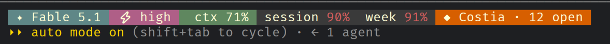

<div align="center">

# Manual Tasks

**Keep the work only you can finish out of forgotten chat messages.**

[](https://github.com/javirub/claude-manual-todos-plugin/actions/workflows/ci.yml)
[](LICENSE)
[](https://code.claude.com/docs/en/plugins)


</div>

A console setting to change, an agreement to accept, a review to answer: Claude
records the manual steps left after its work, with exact values, links and
dependencies. You work through them on a local board, grouped by project.

No account needed. Tasks live in SQLite on your machine; Claude reads and writes
them through the plugin's tools, and nothing leaves the computer unless you ask
it to.

## Install and get started

**You need [Claude Code](https://code.claude.com/docs/en/overview) and
[Bun ≥ 1.2](https://bun.sh/docs/installation), available on PATH.**
Works on Linux, macOS and Windows.

Run these commands **inside Claude Code**:

```text
/plugin marketplace add javirub/claude-manual-todos-plugin
/plugin install todos@claude-manual-todos
```

If the installation asks you to run `/reload-plugins`, do that. Then:

```text
/todos:onboarding
```

Claude asks in **your conversation's language**, with the initial choices grouped
together:

- Enable `todos` in your terminal?
- Add pending tasks to your status line, matching your existing style?
- Open the task board in your browser?

Choose any combination, or skip them all. If your folder has no project, the
assistant also offers to create one or associate it with an existing project.
You can run onboarding again later: it checks what is already configured.

The task tools and automatic recording skill are available without onboarding.
CLI installation, statusline changes and opening the browser are optional.
The first installation may download dependencies; opening the board for the first
time can take longer while it compiles.

## Your first task

Tell Claude about a real manual step. For example:

> Record a task for this project: accept the paid applications agreement in
> App Store Connect before I submit the app.

Claude checks existing projects and tasks before recording it. If you want to
associate the folder yourself first, run `/todos:project`.

Then use:

```text
/todos:tasks
/todos:pendings
```

The first opens the board; the second lists pending work in the conversation.
Complete a step on the board, or tell Claude what you finished. Tasks become done
when all their steps are done.

Claude can also record manual follow-ups as it works, through the automatic
`manual-tasks` skill. You do not need to invoke that skill from the slash menu.

## Commands in Claude Code

| Command | What it does |
|---|---|
| `/todos:onboarding` | Configure the optional integrations, or finish setup later. |
| `/todos:project` | Show the current association, create a project or attach this folder to one. |
| `/todos:statusline` | Add or adjust the tasks segment while keeping your bar's style. |
| `/todos:tasks` | Open the board for this project. |
| `/todos:pendings` | Summarize pending work here, without a browser. |

You can include a request, such as `/todos:project associate this folder with Costia`
or `/todos:statusline use a compact orange segment`.

One project can span several repositories. If you open a different checkout,
`/todos:project` helps attach it to the same project instead of creating a duplicate.

## Tasks in your status line



The orange **◆ Costia · 12 open** segment comes from todos. The model, context and
usage indicators belong to this user's existing bar. Your integration follows
your own style; this screenshot is an example, not a bundled theme.

Run `/todos:statusline` whenever you want to configure or adjust it. If you do not
have a bar yet, it creates a compact one with the model, context percentage and
tasks. You do **not** need to install the terminal CLI or run the board for this.

The tasks segment reads SQLite locally on each render, with no model inference.
It shows the project and open-task count, plus overdue tasks or tasks due today.
It is intentionally hidden when there is no associated project, no open task, or
the segment is disabled. An empty segment after first setup can be normal.

Hide it for one project with the toggle at the bottom of the board's project rail,
or use `todos statusline off` if you enabled the terminal CLI. Add `--global` to
change the default for projects without an override.

## Optional terminal CLI

Enable it during onboarding. These are **terminal commands**, not slash commands:

```sh
todos                 # open the board and print the project's pending tasks
todos pending         # print tasks without opening a browser
todos doctor          # diagnose runtime, database and board problems
todos statusline status
todos statusline off  # hide this project's segment
todos statusline on
todos statusline default # inherit the global preference again
todos serve           # start the board without opening a browser
todos stop            # stop it
```

Inside Claude Code, `!todos pending` runs the CLI without a model inference call.
Its output enters your conversation. Slash commands, by contrast, ask Claude to
carry out a workflow.

The session-start hook also supplies a brief pending-task summary to Claude.
That summary becomes model context; set `CLAUDE_TODOS_QUIET=1` to silence it.

## A board for work outside the editor

| Exact instructions | A recognizable project |
|---|---|
|  |  |
| Values to paste, where they go, and why they matter. | A distinct palette and layout treatment for each project. |


Tasks can link across projects. Steps Claude already completed stay visible and
marked, so you can see what still needs you.

## If something does not appear

| Symptom | What to do |
|---|---|
| New slash commands are missing | Run `/reload-plugins` if available, or restart Claude Code. Check that the plugin is enabled. Existing users need plugin version 1.1.0 or later for onboarding. |
| Bun or the tasks MCP server will not start | Verify Bun in the environment that launches Claude Code. Version-manager shims can differ from your login shell; see the [manual setup guide](docs/setup.md). |
| `todos` is not found in the terminal | Run `/todos:onboarding` and enable the CLI. Open a new terminal after PATH changes. |
| The folder has no project | Run `/todos:project` to create or associate one. |
| The statusline has no tasks segment | Check association, open tasks and visibility. With the CLI enabled, run `todos statusline status`; otherwise ask `/todos:statusline` to check it. |
| The first board launch is slow | A fresh installation may compile the board on demand. Later requests reuse it. |
| An integration broke after an update | Start a new Claude Code session so the opt-in runtime registration refreshes. Rerun onboarding if it still needs repair. |

For more diagnostics, use `todos doctor` after enabling the CLI, or follow the
[manual setup and recovery guide](docs/setup.md).

## More detail

- [Manual setup, existing statusline scripts and recovery](docs/setup.md)
- [Storage, privacy, languages, configuration and architecture](docs/reference.md)
- [Development, tests and screenshots](docs/development.md)

## Licence

[Business Source License 1.1](LICENSE). The source is open and you may run it in
production — for yourself, your team, or your organisation, on your own servers,
at any size. The one thing it does not allow is offering it to third parties as a
commercial hosted service. Four years after each release, that version becomes
Apache 2.0.

Version 1.1.0 and earlier were released under the MIT License and stay available
under those terms; see [LICENSE-MIT](LICENSE-MIT).
