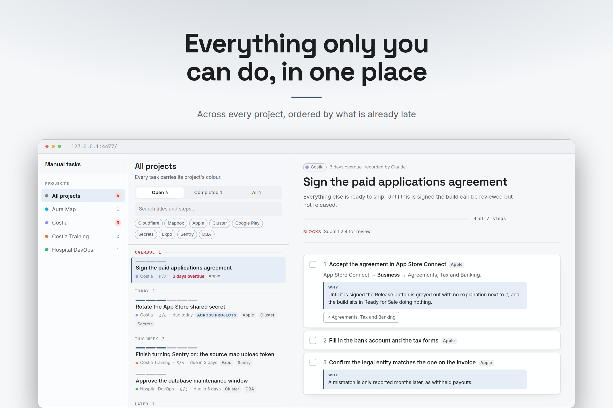
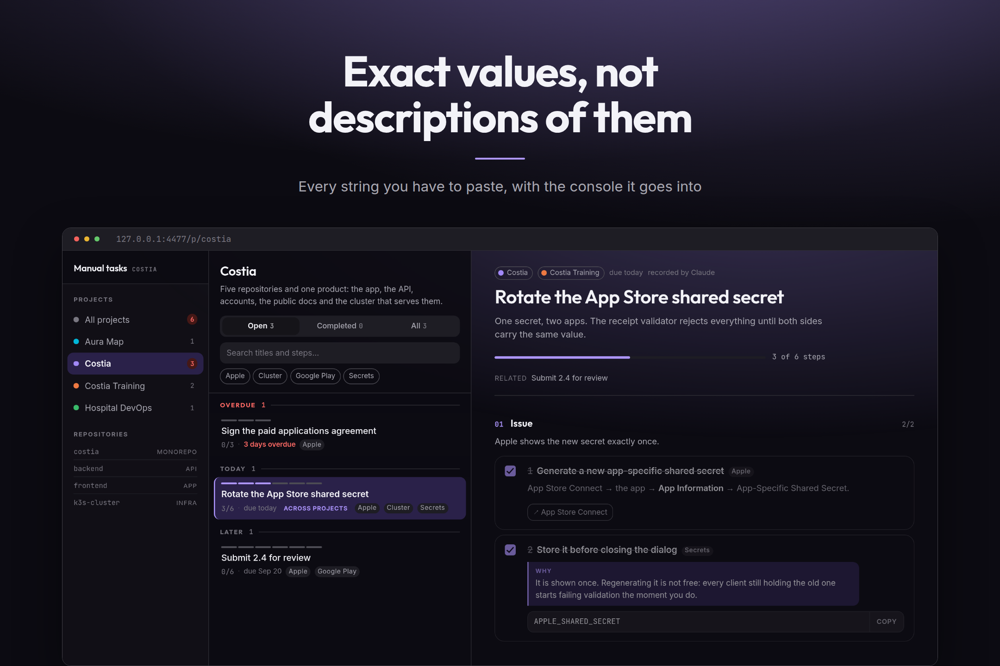
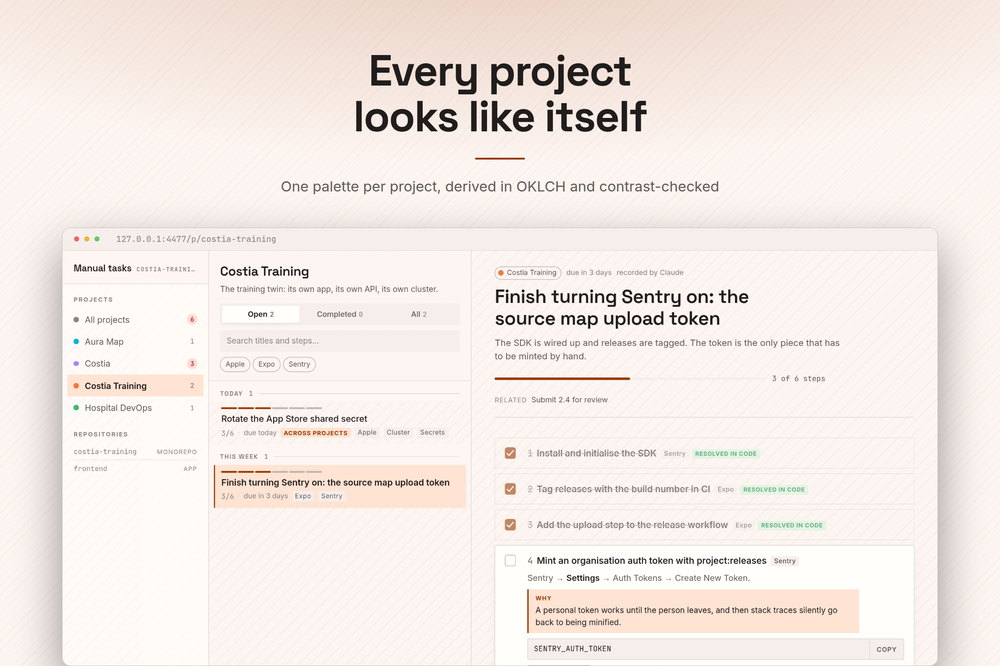
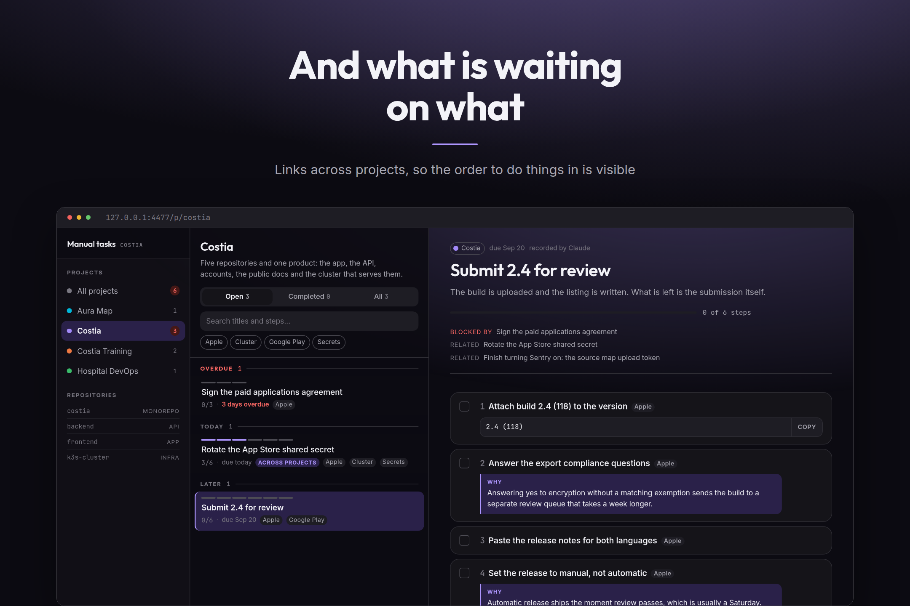

<div align="center">

# Manual todos

**The things only you can do, in one place, ordered by date and separated by project.**

[](https://github.com/javirub/claude-manual-todos-plugin/actions/workflows/ci.yml)
[](LICENSE)
[](https://docs.claude.com/en/docs/claude-code/plugins)



</div>

When Claude finishes a piece of work there is almost always something no
automation can reach: a form in App Store Connect, a secret to seed, a promotion
to trigger, a review to answer. Today that lands in the last message of a session
and is gone by the next one.

This is a SQLite database for exactly that, an MCP server so Claude can write to
it from any repository, and a local board to work through it and tick things off.
Nothing leaves your machine.

## Install

```
/plugin marketplace add javirub/claude-manual-todos-plugin
/plugin install todos@claude-manual-todos
```

Bun ≥ 1.2 on `PATH` is the only requirement. It installs at user level, so the
tools are there in every repository rather than only in this one.

Then do nothing. Claude records what is left for you when it finishes something,
and hands you the link.

## What it looks like

<table>
<tr>
<td width="50%">



**Exact values, not descriptions of them.** The string you are about to paste,
with a copy button, the reason it matters, and a link to the console rather than
to the documentation.

</td>
<td width="50%">



**Every project looks like itself.** One palette per project, derived in OKLCH
from six numbers, with the contrast guaranteed by construction rather than by
taste.

</td>
</tr>
<tr>
<td width="50%">



**And what is waiting on what.** Tasks link across projects, so the order to do
them in is visible instead of remembered. What Claude already fixed in code stays
on the list, marked.

</td>
<td width="50%">

<br>

```
◆ Costia · 3 open · 1 overdue
```

**Without opening anything.** A status-bar segment, a one-line summary at the
start of every session, and a CLI — none of which spend a token. See
[Seeing it for free](#seeing-it-for-free).

</td>
</tr>
</table>

## Using it

In a session:

| | |
|---|---|
| `/todos:tasks` | Opens the board on this project and says what is most urgent. |
| `/todos:pendings` | Lists what is pending in the chat, without a browser. |
| `!todos` | The same thing with **no model turn at all** — see below. |

Claude also reaches for this on its own, through the `manual-tasks` skill,
whenever what it just delivered cannot take effect until you act somewhere it
has no access.

### Seeing it for free

A slash command is a prompt: it costs a model turn, however short. These do not.

**The status bar.** One segment, rendered by Claude Code outside the model:

```jsonc
// ~/.claude/settings.json
{
  "statusLine": {
    "type": "command",
    "command": "bun ~/.claude/plugins/marketplaces/claude-manual-todos/bin/todos.ts statusline"
  }
}
```

If it prints nothing where you expect something, it is almost certainly Bun:
Claude Code renders the status line from its own environment rather than your
login shell, so a Bun installed through **mise, asdf, fnm or Volta** resolves for
you and not for it — the same thing that bites the MCP server. Write the path
`which bun` gives you instead of the bare name.

Already have a status line? Append the segment to yours rather than replacing it.
Three things make that painless:

- it reads **no stdin**, so the JSON your own script has already swallowed with
  `cat` is not its concern — it takes the project from the directory it runs in;
- it prints its own text and nothing else, and **nothing at all** when the
  directory belongs to no project or nothing is pending;
- it never throws and always exits `0`. It cannot be the reason your bar breaks.

At the end of your script, then — with a separating space, because the segment
arrives as bare text, and `$HOME` rather than `~`, which does not expand inside
quotes:

```sh
todos=$(/path/to/bun "$HOME/.claude/plugins/marketplaces/claude-manual-todos/bin/todos.ts" statusline)
if [ -n "$todos" ]; then printf ' %s' "$todos"; fi
```

If your script builds coloured segments, give this one a background of its own
instead: `◆ Costia training · 5 open` is written plain, ready to be wrapped.

Turn it off for one project with `todos statusline off`, or everywhere with
`todos statusline off --global`. There is a toggle at the foot of the board's
project rail that writes the same setting.

**The terminal.** `bun run todos setup` links the CLI into `~/.local/bin`:

```sh
todos                # open the board on this project and print what is pending
todos pending        # the list, no browser
todos doctor         # everything that has to be true for this to work
todos statusline on|off [--global]
todos serve | stop | status | url | open [path]
```

Inside a Claude Code session, type `!todos pending`. The `!` prefix runs it
locally: the output lands in the conversation without any inference happening.

**The session hook.** One line when a session starts in a project that has
something waiting, and silence otherwise. `CLAUDE_TODOS_QUIET=1` turns it off.

## How it works

**The MCP writes to SQLite directly and never calls the board.** Recording a task
must not fail because a web server is down; bringing the interface up is only for
looking. Both processes open the same file in WAL mode.

The database lives at `~/.local/share/claude-tasks/tasks.db` (`$CLAUDE_TASKS_DB`
moves it). Outside the repository on purpose: reinstalling the plugin or deleting
the checkout must not take your tasks with it.

**Nothing leaves your machine.** No account, no sync, no telemetry. The board
binds to `127.0.0.1` and nothing else, which is deliberate: it authenticates
nobody, and it holds the exact values and console links for your pending work —
on a shared network the default of binding every interface would hand all of that
to the room, editable.

<details>
<summary><b>The model</b> — projects, tasks, steps, and why a task's state cannot lie</summary>

<br>

- A **project** can span several repositories (`project_paths`). That is what
  makes `costia/frontend`, `costia/backend` and `costia/docs-site` one project,
  and what answers "which project am I in?": the longest registered path that
  contains the working directory wins, so a repository claims its own
  subdirectories back from the superproject above it.
- A **task** can belong to several projects with a single shared state, and can
  be linked to another with `blocks` or `relates` — across projects too.
- A task's state is **derived**: it is done when every one of its steps is. There
  is no field that can lie.
- Every step remembers **who closed it**. The ones Claude resolved in code stay
  visible, marked as such, rather than disappearing: seeing what is already done
  is half the context for why the rest is still open.

</details>

<details>
<summary><b>Per-project identity</b> — six numbers, and why an agent cannot make it unreadable</summary>

<br>

Switching project changes the look of the whole interface, so you know where you
are without reading anything. A theme is six numbers in the database — hue,
chroma, how much the greys are tinted, mode, texture, typeface — and the entire
palette is derived from them in OKLCH.

**The lightness ramp is fixed per mode and is not exposed.** Text-on-background
contrast is guaranteed by construction, so an agent can invent the identity of a
new project without being able to make anything unreadable. When a project is
created, a hue within 25° of another is refused: two projects that look alike
defeat the purpose.

`test/theme.test.ts` sweeps the whole hue circle in both modes against WCAG AA.
It has already caught two real contrast failures, so keep it passing when you
touch those ramps.

</details>

<details>
<summary><b>Language</b> — three audiences, and they do not get the same words</summary>

<br>

**The repository speaks English**, always: this file, the skill, the commands, the
MCP tool descriptions, code comments and commit messages. So does the scaffolding
the MCP prints back to Claude — bucket headings, `why:`, `value:`, "done by agent"
— in `src/lib/format/text.ts`.

**The board speaks the user's language.** English and Spanish so far, through
[next-intl](https://next-intl.dev): catalogues in `messages/*.json` with ICU
plurals, the request config in `src/i18n/request.ts`, and a switch at the foot of
the project rail.

**Task content is written in the user's language too**, by the agent, and stored
as written. `where_am_i` prints the language on every call so Claude does not have
to guess, and `set_locale` changes it. Existing tasks are never retranslated: a
task recorded in Spanish stays in Spanish when the board is switched to English,
because it is a note someone wrote, not a label.

The locale lives in SQLite rather than in a cookie or the URL. It is not only a
display preference — the agent reads the same setting — and a per-browser cookie
would let the board and Claude disagree about it.

Two things keep the catalogues honest, so neither is done by hand:

- `global.d.ts` augments next-intl with `typeof messages/en.json`, which makes a
  wrong or missing key a **compile error** (`bun run typecheck`).
- `bun run lint:messages` runs [`@eloqnt/cli`](https://cli.eloqnt.dev), which finds
  missing translations, ICU arguments that disagree between locales, and messages
  nothing uses. It has already caught two dead keys.

To add a locale: add `messages/<code>.json`, extend `LOCALES` in
`src/lib/db/settings.ts` with its label, and run both of the above.

</details>

<details>
<summary><b>Requirements and environment</b></summary>

<br>

| | |
|---|---|
| **Bun** | ≥ 1.2, on `PATH`. Developed on 1.4. It is the only hard requirement: the MCP server, the CLI, the session hook and the board all run on it. |
| **Operating system** | Linux, macOS and Windows. CI runs the whole suite on all three, including starting and stopping the board, because that is where they differ. |
| **Node.js** | Not needed to use the plugin. Only `scripts/db-portability.mjs` runs on it, and that wants ≥ 22.5 for `node:sqlite`. |
| **Network** | Once, at build time: `next/font` fetches the four typefaces and self-hosts them. Nothing is fetched at runtime — the board works offline, which matters when the reason you are looking at it is that something else is broken. |

The plugin is **not runnable on Node** as it stands: the source imports without
file extensions and leans on the `@/` path alias, neither of which Node resolves.
That is a deliberate limit rather than an oversight — what the `node:sqlite`
driver buys is narrower and more useful: **the database outlives the runtime**.
A `tasks.db` written by Bun opens in plain Node with no Bun installed, which CI
checks on every platform, so your tasks are never hostage to this choice.

| | |
|---|---|
| `CLAUDE_TASKS_DB` | Where the database lives. Default: `~/.local/share/claude-tasks/tasks.db`, or `%LOCALAPPDATA%\claude-tasks\tasks.db` on Windows. |
| `CLAUDE_TASKS_PORT` | The board's port, read by `todos` and by the MCP. Default 4477. Running `bun run dev` or `bun run start` directly bypasses the CLI, so those take Next's own `PORT` instead. |
| `CLAUDE_TODOS_QUIET` | Set to anything to silence the session-start line. |
| `XDG_DATA_HOME`, `XDG_STATE_HOME` | Honoured where set, on every platform. |

</details>

## Troubleshooting

**Start here:** `todos doctor` checks everything that has to be true and names
whichever part is not.

| | |
|---|---|
| **The `tasks` MCP server fails with `CONNECTION_CLOSED`** | Almost always Bun. Claude Code spawns MCP servers from its own environment, which is not your login shell — so a Bun installed through **mise, asdf, fnm or Volta** resolves for you and not for it. `todos doctor` says so explicitly when it finds a shim. Fix it by pointing the plugin's `.mcp.json` `command` at the real binary (`which bun` gives the path), or at `${CLAUDE_PLUGIN_ROOT}/bin/mcp.sh`, which goes looking. |
| **The board takes twenty seconds the first time** | A fresh checkout has no build, so it falls back to `next dev` and compiles on demand. Run `bun run build` once in the plugin directory and it starts instantly from then on. |
| **The port is taken** | `CLAUDE_TASKS_PORT=4488`, in the environment Claude Code sees. |
| **`bun install` runs on first use** | Expected. The marketplace clones the repository without dependencies, so the MCP server installs them for itself (`mcp/preflight.ts`). It only happens once. |
| **The status bar shows nothing** | It is silent by design when the directory belongs to no project or nothing is pending. `todos statusline status` says which of those it is — and if it says the segment should show while the bar stays empty, Claude Code cannot resolve `bun`: same shim problem as the row above, fixed the same way. |

## Development

```sh
bun test              # schema, path containment, derived state, ordering, themes, manifests
bun run typecheck     # includes message keys, via the next-intl augmentation
bun run lint:messages # catalogue health: missing, inconsistent or orphan messages
bun run dev
```

To work on the plugin itself, register this checkout as its own marketplace so
`${CLAUDE_PLUGIN_ROOT}` points at your working tree and edits are live:

```
/plugin marketplace add /path/to/this/checkout
/plugin install todos@claude-manual-todos
```

Anything that touches paths, spawns a process or kills one deserves a look on
more than one platform. CI covers it, and the parts most likely to break are
`isWithin` in `src/lib/db/paths.ts` (separators and case folding) and the
serve/stop pair in `bin/todos.ts` (process groups on Unix, `taskkill /T` on
Windows).

The MCP tools are the plugin's interface and nothing above exercises the
protocol itself, so there is a driver for that:

```sh
bun scripts/mcp-smoke.ts                                  # handshake + tool inventory
bun scripts/mcp-smoke.ts where_am_i '{"cwd":"/some/path"}'
```

Run it after touching `mcp/main.ts`, and on any Renovate PR that moves
`@modelcontextprotocol/server` or `zod`. Point `CLAUDE_TASKS_DB` at a scratch
file before calling anything that writes.

### The pictures

```sh
bun run shots                  # seed, build, capture, frame — into docs/media/
bun run shots -- --skip-build  # reuse .next
bun run shots -- --keep        # leave the demo board up to click around in
```

It seeds a throwaway database (`scripts/seed-demo.ts`, English, dates relative to
today) on its own port, so neither your tasks nor a board you have open are
touched. Every shot waits on an **anchor** — a string that only exists once the
screen has really rendered — because otherwise a photograph of a loading state is
indistinguishable from a green run. Regenerate them whenever the interface
changes; CI fails if the files the README points at are missing.

**Then look at the pictures.** The exit code says a screen rendered, not that it
rendered right.

## Layout

```
.claude-plugin/   plugin manifest and marketplace entry
.mcp.json         declares the "tasks" MCP server
messages/         en.json and es.json — the board's own words, in ICU
skills/           when to record a task, and how to write a step
commands/         /todos:tasks and /todos:pendings
hooks/            one line at session start with what is pending here
bin/todos.ts      the CLI: board lifecycle, the digest, the statusline, doctor
bin/mcp.sh        finds Bun when a version manager has hidden it
mcp/server.ts     launcher: checks dependencies, then hands over to main.ts
mcp/main.ts       21 MCP tools over the database
src/lib/db/       schema, migrations and queries — shared by the MCP and the app
src/lib/digest.ts one answer to "what is waiting here", for the CLI, bar and hook
src/lib/theme/    each project's palette, derived in OKLCH
src/app/          the board
scripts/          the demo seed, the screenshot pipeline, the MCP smoke driver
docs/media/       the pictures above, regenerated by bun run shots
renovate.json     dependency updates, via the Renovate GitHub App
.github/          CI on Linux, macOS and Windows
```

## Licence

MIT. See [LICENSE](LICENSE).
