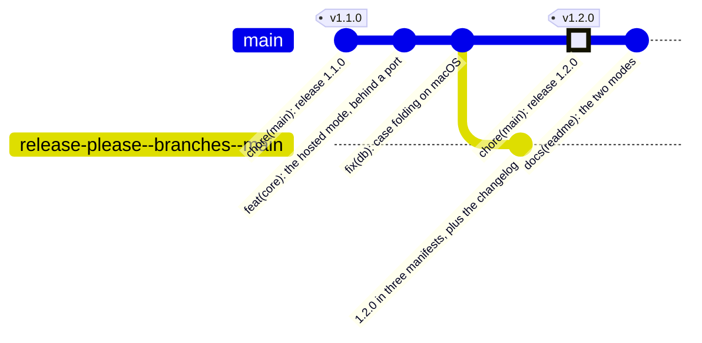

# Development

[Back to the quick start](../README.md)

```sh
bun test              # schema, path containment, derived state, ordering, themes, manifests
bun run typecheck     # includes message keys, via the next-intl augmentation
bun run lint:messages # catalogue health: missing, inconsistent or orphan messages
bun run dev
```

To load this checkout directly, without installing or changing user settings:

```sh
claude --plugin-dir .
claude plugin validate .claude-plugin/plugin.json
claude plugin validate .claude-plugin/marketplace.json
```

Run `/reload-plugins` after changing skills in an interactive session, or start a
new test session. Exercise `/todos:onboarding`, `/todos:statusline` and
`/todos:project` in English and Spanish. Use an isolated Claude configuration
directory, temporary database and state directory for setup tests; never install
test launchers in your actual user PATH.

The new command skills are user-only. Their shared references are read directly
by onboarding, rather than invoking another user-only skill. `manual-tasks` stays
model-invocable and is hidden from the slash menu.

Anything that touches paths, spawns a process or kills one deserves a look on
more than one platform. CI covers it, and the parts most likely to break are
`isWithin` in `src/lib/db/paths.ts` (separators and case folding) and the
serve/stop pair in `bin/todos.ts` (process groups on Unix, `taskkill /T` on
Windows).

The MCP tools are the plugin's interface and nothing above exercises the
protocol itself, so there is a driver for that:

```sh
bun scripts/mcp-smoke.ts                                  # handshake + tool inventory
bun scripts/mcp-smoke.ts where_am_i '{"cwd":"/some/path"}'
```

Run it after touching `mcp/main.ts`, and on any Renovate PR that moves
`@modelcontextprotocol/server` or `zod`. Point `CLAUDE_TASKS_DB` at a scratch
file before calling anything that writes.

### The pictures

```sh
bun run shots                  # seed, build, capture, frame — into docs/media/
bun run shots -- --skip-build  # reuse .next
bun run shots -- --keep        # leave the demo board up to click around in
```

It seeds a throwaway database (`scripts/seed-demo.ts`, English, dates relative to
today) on its own port, so neither your tasks nor a board you have open are
touched. Every shot waits on an **anchor** — a string that only exists once the
screen has really rendered — because otherwise a photograph of a loading state is
indistinguishable from a green run. Regenerate them whenever the interface
changes; CI fails if the files the README points at are missing.

`docs/media/manual/` holds the pictures no run produces — today, the terminal
screenshot of the statusline. The screenshot script wipes everything else in
`docs/media/` and leaves that directory alone, so put any hand-made picture there.
CI checks both groups.

**Then look at the pictures.** The exit code says a screen rendered, not that it
rendered right.

## Branches

`main` takes pull requests, not pushes. A branch is `<type>/<kebab-case>`, squash
merged, and deleted on the way in — so `main` carries no merge commits and
`git log --oneline` is one readable line per change. The diagram and the commit
grammar are in [CONTRIBUTING.md](../CONTRIBUTING.md); this section is what
happens after a change has landed.

## Releases

The commits decide the version. Nothing chooses a number.



A `feat` raises the minor, a `fix` the patch, and a `!` or a `BREAKING CHANGE:`
footer the major. release-please keeps that branch alive and **rewrites it whole
on every push to `main`**, so it always proposes the version the current history
asks for. The tag and the GitHub Release are born when you merge it, never
before: merging the release pull request *is* the decision to publish.

Four files move together in that pull request, and `manifest.test.ts` is what
keeps them from drifting:

| | |
|---|---|
| `package.json` | the `node` strategy bumps it |
| `.claude-plugin/plugin.json` | `extra-files`, `$.version` |
| `.claude-plugin/marketplace.json` | `extra-files`, `$.plugins[0].version` |
| `.release-please-manifest.json` | where it reads the last released version from |

That marketplace path is by **index**, because release-please's json updater
takes a plain JSONPath and not a filter. `test/githooks.test.ts` asserts
`plugins[0].name` is this plugin, which is what makes the index correct rather
than lucky.

**To release a specific version**, put `Release-As: 2.0.0` in the pull request
body. Editing the version in the manifests by hand is now a mistake rather than a
procedure, and the tests fail on it.

**The token is load-bearing.** `.github/workflows/release-please.yml` runs with
`secrets.RELEASE_PLEASE_TOKEN`, a fine-grained PAT, and not with `GITHUB_TOKEN`.
A pull request opened by `GITHUB_TOKEN` starts no workflow run — and with
required status checks, a pull request that never reports a status can never be
merged. The release would not be unverified; it would be stuck. When releases
quietly stop happening, that token has expired.

**If the release pull request goes red**, fix the cause in a pull request of its
own. The bot rebuilds its branch from scratch on the next push to `main`.

**A tag does not change what a new install gets.** `marketplace.json` says
`"source": "./"`, so installing clones `main`. The tag is for pinning, for the
release notes, and for saying afterwards which commit was which.

## The hooks

`bun run hooks` points git at `.githooks/`. What goes in which hook is decided by
measurement, not by category:

| | Cost | Where |
|---|---|---|
| `manifest`, `docs`, `paths` tests | 11 ms | `pre-commit` |
| `typecheck` | 144 ms | `pre-push` |
| `lint:messages` | 136 ms | `pre-push` |
| the whole suite | 1.7 s | `pre-push` |
| `bun run build` | minutes | CI only |

Two are in no hook at all, and for reasons worth knowing:

- **`scripts/mcp-smoke.ts`** starts the MCP server, whose preflight can run
  `bun install`. A hook that installs dependencies behind your back is a hook
  that will one day do it at the wrong moment.
- **`scripts/db-portability.mjs`** needs a database that already has a schema,
  and with no `CLAUDE_TASKS_DB` it opens **the real one** — the board's own task
  list. Every hook here exports a scratch path for the same reason.

## What `main` allows

Not applied by this repository — a repository cannot protect itself — so these
are the commands, and they are here rather than in a runbook nobody opens.

```bash
repo=javirub/claude-manual-todos-plugin

gh api --method PATCH "repos/$repo" \
  -F allow_squash_merge=true -F allow_merge_commit=false -F allow_rebase_merge=false \
  -f squash_merge_commit_title=PR_TITLE -f squash_merge_commit_message=PR_BODY \
  -F delete_branch_on_merge=true -F allow_auto_merge=true -F allow_update_branch=true
```

`squash_merge_commit_title=PR_TITLE` is the line that makes the rest work.
GitHub's default is `COMMIT_OR_PR_TITLE`, which quietly uses the branch commit's
subject when a pull request has exactly one commit — and then the title check in
`pr.yml` is guarding a string that never lands.

```bash
gh api --method PUT "repos/$repo/branches/main/protection" --input - <<'JSON'
{
  "required_status_checks": {
    "strict": true,
    "checks": [
      { "context": "ubuntu-latest" },
      { "context": "macos-latest" },
      { "context": "windows-latest" },
      { "context": "the pull request title is a conventional commit" },
      { "context": "the contributor licence agreement is accepted" }
    ]
  },
  "enforce_admins": true,
  "required_pull_request_reviews": null,
  "restrictions": null,
  "required_linear_history": true,
  "allow_force_pushes": false,
  "allow_deletions": false,
  "required_conversation_resolution": true
}
JSON
```

Four things there are not obvious:

- **Those contexts are job names, not workflow names.** `ci.yml`'s job is called
  `${{ matrix.os }}`, so the three operating systems appear literally. Rename
  that `name:` and `main` locks with no explanation.
- **`required_pull_request_reviews: null` is deliberate.** The release pull
  request is opened by the PAT, which is you, and nobody approves their own pull
  request on GitHub. Require approvals and every release dies in the water. The
  control here is CI, not a second pair of eyes that does not exist.
- **`enforce_admins: true`** is what makes this determinism rather than
  decoration: nothing reaches `main` without the matrix, not even the owner.
- **`strict: true`** requires the branch to be current, which costs re-runs and
  buys the absence of surprise semantic merges. `allow_auto_merge` makes it a
  click.

The way out, for the day a check is renamed and nothing can merge:

```bash
gh api --method DELETE "repos/$repo/branches/main/protection"
```

## Layout

```
.claude-plugin/   plugin manifest and marketplace entry
.mcp.json         declares the "tasks" MCP server
messages/         en.json and es.json — the board's own words, in ICU
skills/           onboarding, statusline, project and automatic task recording
commands/         /todos:tasks and /todos:pendings
hooks/            one line at session start with what is pending here
bin/todos.ts      the CLI: board lifecycle, digest, statusline, setup and doctor
bin/launcher.mjs  stable launcher template, copied into the user state directory
src/lib/integration.ts  opt-in installation and runtime registration
bin/mcp.sh        finds Bun when a version manager has hidden it
mcp/server.ts     launcher: checks dependencies, then hands over to main.ts
mcp/main.ts       28 MCP tools over the database
src/lib/db/       schema, migrations and queries — shared by the MCP and the app
src/lib/digest.ts one answer to "what is waiting here", for the CLI, bar and hook
src/lib/theme/    each project's palette, derived in OKLCH
src/app/          the board
scripts/          the demo seed, the screenshot pipeline, the MCP smoke driver
docs/media/       the board captures; docs/media/manual/ the hand-made ones
renovate.json     dependency updates, via the Renovate GitHub App
.githooks/        commit-msg, pre-commit and pre-push; `bun run hooks` installs them
scripts/commit-lint.sh  the one definition of a commit message, shared with CI
.github/          CI on three operating systems, the release pull request, the PR checks
release-please-config.json  what the release pull request rewrites
```
